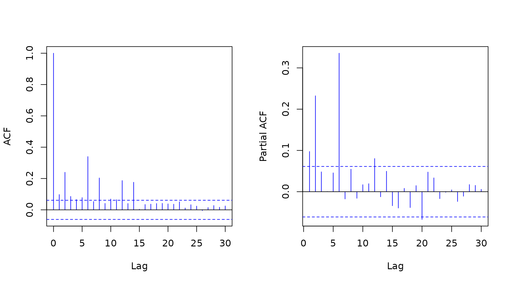

# Introduction to the mtarm Package

## Multivariate Threshold Autoregressive (TAR) models

The `mtarm` package provides a computational tool designed for Bayesian
estimation, inference, and forecasting in multivariate Threshold
Autoregressive (TAR) models. These models provide a versatile approach
for modeling nonlinear multivariate time series and include multivariate
Self-Exciting Threshold Autoregressive (SETAR) and Vector Autoregressive
(VAR) models as particular cases (Vanegas et al. 2025). The package
accommodates a broad class of innovation distributions beyond the
Gaussian assumption, such as Student-$`t`$, slash, symmetric hyperbolic,
Laplace, contaminated normal, skew-normal, and skew-$`t`$ distributions,
thereby enabling robust modeling of heavy tails, asymmetry, and other
non-Gaussian characteristics.

### Installation

#### Install from GitHub

``` r

remotes::install_github("lhvanegasp/mtarm")
```

#### Install from CRAN

``` r

install.packages("mtarm")
```

### Application: Temperature, precipitation, and two river flows in Iceland

#### Dataset

The data are available in the object \`iceland.rf\` and were obtained
from (Tong 1990), who provided a detailed description of the
geographical and meteorological characteristics of the rivers and
analyzed each series individually. Subsequently, (Tsay 1998) conducted a
bivariate analysis of the same dataset. The focus is on the bivariate
time series $`\{(Y_{1,t},Y_{2,t})^{\top}\}_{t\geq 1}`$, where
$`Y_{1,t}`$ and $`Y_{2,t}`$ denote the daily river flow (in cubic meters
per second, $`{m}^3/{s}`$) of the Jökulsá Eystri and Vatnsdalsá rivers,
respectively. The sample covers the period from 1972 to 1974, comprising
1095 observations. The exogenous variables include daily precipitation
$`X_t`$, measured in millimeters ($`{mm}`$), and temperature $`Z_t`$,
measured in degrees Celsius ($`^\circ\mathrm{C}`$), both recorded at the
meteorological station in Hveravellir. Precipitation corresponds to the
accumulated rainfall from 9:00 A.M. of the previous day to 9:00 A.M. of
the current day.

``` r

library(mtarm)
data(iceland.rf)       
str(iceland.rf)     
#> 'data.frame':    1096 obs. of  5 variables:
#>  $ Vatnsdalsa   : num  16.1 19.2 14.5 11 13.6 12.5 10.5 10.1 9.68 9.02 ...
#>  $ Jokulsa      : num  30.2 29 28.4 27.8 27.8 27.8 27.8 27.8 27.8 27.3 ...
#>  $ Precipitation: num  8.1 4.4 7 0 0 0 1.9 1.2 0 0.1 ...
#>  $ Temperature  : num  0.9 1.6 0.1 0.6 2 0.8 1.4 1.3 2.2 0.1 ...
#>  $ Date         : Date, format: "1972-01-01" "1972-01-02" ...
```

``` r

summary(iceland.rf[,-5])
#>    Vatnsdalsa        Jokulsa       Precipitation     Temperature      
#>  Min.   : 3.670   Min.   : 22.00   Min.   : 0.000   Min.   :-22.4000  
#>  1st Qu.: 6.100   1st Qu.: 26.70   1st Qu.: 0.000   1st Qu.: -4.2000  
#>  Median : 7.500   Median : 31.40   Median : 0.300   Median :  0.3000  
#>  Mean   : 8.938   Mean   : 41.15   Mean   : 2.519   Mean   : -0.4407  
#>  3rd Qu.: 9.240   3rd Qu.: 50.90   3rd Qu.: 2.500   3rd Qu.:  3.9000  
#>  Max.   :54.000   Max.   :143.00   Max.   :79.300   Max.   : 13.9000
```

``` r

plot(ts(as.matrix(iceland.rf[,-5])), main="Iceland")
```


#### Model specification

Following (Tsay 1998), the series are modeled using a
$`\mathrm{TAR}(2; p=(15,15), q=(4,4), d=(2,2))`$ specification given by

``` math
Y_t=
\sum_{j=1}^{2}
I\!\left(Z_{t-h}\in(c_{j-1},c_j]\right)
\left(\!
\phi_0^{^{(j)}}
+\sum_{i=1}^{15}\boldsymbol{\phi}_i^{^{(j)}}Y_{t-i}
+\sum_{i=1}^{4}\boldsymbol{\beta}_i^{^{(j)}}X_{t-i}
+\sum_{i=1}^{2}\delta_i^{^{(j)}}Z_{t-i}
+\epsilon_t^{^{(j)}}
\!\right)
```

where $`\epsilon_t^{^{(j)}}`$ is the error term. The last 55
observations (from November 7 to December 31, 1974), corresponding to
$`5\%`$ of the sample, are excluded from the estimation stage and
reserved for out-of-sample forecast evaluation. The following code
requests the estimation for the
$`\mathrm{TAR}(2; p=(15,15), q=(4,4), d=(2,2))`$ specification under
Gaussian, Student-$`t`$, and Laplace error distributions.

#### Parameter estimation

``` r

set.seed(09102)
fits <- mtar_grid(~ Jokulsa + Vatnsdalsa | Temperature | Precipitation,
                  data=iceland.rf, subset={Date<="1974-11-06"},                           
                  row.names=Date, nregim.min=2, nregim.max=2, p.min=15,                 
                  p.max=15, q.min=4, q.max=4, d.min=2, d.max=2,                           
                  n.burnin=5000, n.sim=4000, n.thin=2, ssvs=TRUE,
                  dist=c("Gaussian","Student-t","Laplace"),
                  plan_strategy="multisession")

fits
#> 
#> 
#> Sample size          : 1026 time points (1972-01-16 to 1974-11-06)
#> 
#> Output Series        : Jokulsa    |    Vatnsdalsa
#> 
#> Threshold Series (TS): Temperature
#> 
#> Exogenous Series (ES): Precipitation
#> 
#> Error Distribution   : Gaussian, Laplace, Student-t
#> 
#> Number of regimes    : 2
#> 
#> Deterministics       : Intercept
#> 
#> Autoregressive order : 15
#> 
#> Maximum lag for ES   : 4
#> 
#> Maximum lag for TS   : 2
```

#### Model comparison using forecast accuracy measures

##### Adjusted within-sample

The following code requests Deviance Information Criterion (DIC)
(Spiegelhalter et al. 2002, 2014) and Watanabe-Akaike Information
Criterion (WAIC) (Watanabe 2010) values.

``` r

DIC(fits)
#>                          DIC
#> Gaussian.2.15.4.2  10060.438
#> Laplace.2.15.4.2    6947.448
#> Student-t.2.15.4.2  7532.597

WAIC(fits)
#>                         WAIC
#> Gaussian.2.15.4.2  10404.091
#> Laplace.2.15.4.2    8188.797
#> Student-t.2.15.4.2  7642.630
```

##### Out-of-sample with standard $`h`$-step-ahead forecasting

In addition, the following code provides the median of the log-score
(Good 1952), the Energy Score (ES) (Gneiting et al. 2008)—a multivariate
extension of the Continuous Ranked Probability Score (CRPS)(Matheson and
Winkler 1976; Grimit et al. 2006)—and the Absolute Percentage Error
(APE), all computed from the observed and forecasted values for the last
55 observations.

``` r

newdata <- subset(iceland.rf, Date>"1974-11-06") 
set.seed(09102)

oos <- out_of_sample(fits, newdata=newdata, n.ahead=nrow(newdata), FUN=median) 
oos[,c(1,2,5,6)]
#>                    Log.Score Energy.Score Jokulsa.APE Vatnsdalsa.APE
#> Gaussian.2.15.4.2   3.797904     2.811035    5.652454       32.49836
#> Laplace.2.15.4.2    3.259450     1.820050    3.738226       15.60301
#> Student-t.2.15.4.2  3.545381     2.456398    3.676001       20.90241
```

##### Out-of-sample with rolling-origin forecasting and fixed parameters

``` r

set.seed(09102)
oos2 <- out_of_sample(fits, newdata=newdata, n.ahead=nrow(newdata), 
                      rolling=5, FUN=median) 

for(i in 1:length(oos2)){                   
   cat("\n",i,"-step-ahead\n")   
   print(oos2[[i]][,c(1,2,5,6)]) 
}                            
#> 
#>  1 -step-ahead
#>                    Log.Score Energy.Score Jokulsa.APE Vatnsdalsa.APE
#> Gaussian.2.15.4.2   2.584186    1.2773363   1.5798016       7.274053
#> Laplace.2.15.4.2    1.290926    0.7556162   0.8853437       4.733333
#> Student-t.2.15.4.2  1.020333    0.7762098   0.9009402       5.917259
#> 
#>  2 -step-ahead
#>                    Log.Score Energy.Score Jokulsa.APE Vatnsdalsa.APE
#> Gaussian.2.15.4.2   3.032747     1.639617    2.301814      11.871226
#> Laplace.2.15.4.2    2.094174     1.082328    1.478344       5.500908
#> Student-t.2.15.4.2  1.968642     1.213108    1.447799       6.566068
#> 
#>  3 -step-ahead
#>                    Log.Score Energy.Score Jokulsa.APE Vatnsdalsa.APE
#> Gaussian.2.15.4.2   3.223748     1.850762    2.926733      14.934488
#> Laplace.2.15.4.2    2.365237     1.235656    1.965210       6.654542
#> Student-t.2.15.4.2  2.305891     1.466251    1.926638       8.003508
#> 
#>  4 -step-ahead
#>                    Log.Score Energy.Score Jokulsa.APE Vatnsdalsa.APE
#> Gaussian.2.15.4.2   3.333167     1.968623    3.509917      17.344735
#> Laplace.2.15.4.2    2.559574     1.355290    2.262832       6.319183
#> Student-t.2.15.4.2  2.616427     1.691429    2.414252       7.173568
#> 
#>  5 -step-ahead
#>                    Log.Score Energy.Score Jokulsa.APE Vatnsdalsa.APE
#> Gaussian.2.15.4.2   3.405086     2.079208    3.701430      19.487190
#> Laplace.2.15.4.2    2.695588     1.451628    2.543371       6.805743
#> Student-t.2.15.4.2  2.828487     1.838202    2.802228       9.591203
```

#### Summary of the best model

``` r

summary(fits[["Laplace.2.15.4.2"]])
#> 
#> 
#> Sample size          : 1026 time points (1972-01-16 to 1974-11-06)
#> 
#> Output Series (OS)   : Jokulsa    |    Vatnsdalsa
#> 
#> Threshold Series (TS): Temperature with a estimated delay equal to 0
#> 
#> Exogenous Series (ES): Precipitation
#> 
#> Error Distribution   : Laplace
#> 
#> Number of regimes    : 2
#> 
#> Deterministics       : Intercept
#> 
#> Autoregressive orders: 15 in each regime
#> 
#> Maximum lags for ES  : 4 in each regime
#> 
#> Maximum lags for TS  : 2 in each regime
#> 
#> 
#> Thresholds (Mean, HDI.Lower, HDI.Upper)
#>                                                         
#> Regime 1 (-Inf,-0.44861] (-Inf,-0.49439] (-Inf,-0.40095]
#> Regime 2  (-0.44861,Inf)  (-0.49439,Inf)  (-0.40095,Inf)
#> 
#> 
#> Regime1:
#>      OS.lag(1) OS.lag(2) OS.lag(3) OS.lag(4) OS.lag(5) OS.lag(6) OS.lag(7)
#> SSVS         1         1      0.03      0.25      0.02      0.49         0
#>      OS.lag(8) OS.lag(9) OS.lag(10) OS.lag(11) OS.lag(12) OS.lag(13) OS.lag(14)
#> SSVS         0      0.01       0.19       0.02          0       0.01       0.21
#>      OS.lag(15) ES.lag(1) ES.lag(2) ES.lag(3) ES.lag(4) TS.lag(1) TS.lag(2)
#> SSVS       0.14         0         0         0         0      0.03      0.05
#> 
#> Autoregressive coefficients
#>                        Mean  2(1-PD)  HDI.Lower HDI.Upper             Mean
#> (Intercept)         4.51022   0.00001   3.51623   5.55975    |     1.20744
#> Jokulsa.lag( 1)     0.77192   0.00001   0.66024   0.87739    |    -0.08292
#> Vatnsdalsa.lag( 1)  0.29604   0.00001   0.17797   0.40980    |     1.08540
#> Jokulsa.lag( 2)    -0.00399   0.88800  -0.06452   0.05557    |     0.04298
#> Vatnsdalsa.lag( 2) -0.24571   0.00250  -0.36565  -0.12194    |    -0.21631
#>                     2(1-PD)  HDI.Lower HDI.Upper
#> (Intercept)          0.00100   0.73286   1.66171
#> Jokulsa.lag( 1)      0.00150  -0.12750  -0.03556
#> Vatnsdalsa.lag( 1)   0.00001   0.98026   1.18596
#> Jokulsa.lag( 2)      0.01350   0.00917   0.07567
#> Vatnsdalsa.lag( 2)   0.00001  -0.30002  -0.13651
#> 
#> Scale parameter (Mean, HDI.Lower, HDI.Upper)
#>            Jokulsa Vatnsdalsa      Jokulsa Vatnsdalsa      Jokulsa Vatnsdalsa
#> Jokulsa    0.15953    0.02508    . 0.12522    0.01152    . 0.19860    0.03786
#> Vatnsdalsa 0.02508    0.06131    . 0.01152    0.04601    . 0.03786    0.07630
#> 
#> 
#> Regime2:
#>      OS.lag(1) OS.lag(2) OS.lag(3) OS.lag(4) OS.lag(5) OS.lag(6) OS.lag(7)
#> SSVS         1         1      0.66         0         0         0         0
#>      OS.lag(8) OS.lag(9) OS.lag(10) OS.lag(11) OS.lag(12) OS.lag(13) OS.lag(14)
#> SSVS         0         0          0          0          0          0          0
#>      OS.lag(15) ES.lag(1) ES.lag(2) ES.lag(3) ES.lag(4) TS.lag(1) TS.lag(2)
#> SSVS          0      0.01         0         0         0         1         1
#> 
#> Autoregressive coefficients
#>                        Mean  2(1-PD)  HDI.Lower HDI.Upper             Mean
#> (Intercept)         1.60340   0.00300   0.67618   2.58337    |     0.57062
#> Jokulsa.lag( 1)     1.07939   0.00001   1.00745   1.15019    |    -0.00020
#> Vatnsdalsa.lag( 1)  0.57907   0.00001   0.33550   0.80825    |     1.16138
#> Jokulsa.lag( 2)    -0.20936   0.00001  -0.29926  -0.10615    |     0.00338
#> Vatnsdalsa.lag( 2) -0.51604   0.02050  -0.99910  -0.05121    |    -0.34293
#> Jokulsa.lag( 3)    -0.01124   0.66450  -0.05945   0.05532    |    -0.00957
#> Vatnsdalsa.lag( 3)  0.34318   0.00150   0.15838   0.61810    |     0.16731
#> Temperature.lag(1)  1.11871   0.00001   0.90525   1.34358    |     0.04985
#> Temperature.lag(2) -0.65944   0.00001  -0.86104  -0.45911    |    -0.05381
#>                     2(1-PD)  HDI.Lower HDI.Upper
#> (Intercept)          0.00001   0.34706   0.80298
#> Jokulsa.lag( 1)      0.98400  -0.01246   0.01362
#> Vatnsdalsa.lag( 1)   0.00001   1.09343   1.23995
#> Jokulsa.lag( 2)      0.72000  -0.01463   0.02066
#> Vatnsdalsa.lag( 2)   0.00001  -0.50808  -0.15643
#> Jokulsa.lag( 3)      0.08350  -0.01986   0.00213
#> Vatnsdalsa.lag( 3)   0.00001   0.07848   0.24376
#> Temperature.lag(1)   0.01700   0.01048   0.09288
#> Temperature.lag(2)   0.00350  -0.09380  -0.01668
#> 
#> Scale parameter (Mean, HDI.Lower, HDI.Upper)
#>            Jokulsa Vatnsdalsa      Jokulsa Vatnsdalsa      Jokulsa Vatnsdalsa
#> Jokulsa    5.55803    0.32444    . 4.58451    0.19699    . 6.47017    0.44727
#> Vatnsdalsa 0.32444    0.31074    . 0.19699    0.26144    . 0.44727    0.36344
#> 
```

#### Residuals

``` r

res <- residuals(fits[["Laplace.2.15.4.2"]])  
```

``` r

par(mfrow=c(1,2)) 
qqnorm(res[["full"]], pch=20, col="blue", main="") 
abline(0, 1, lty=3) 
hist(res[["full"]], freq=FALSE, xlab="Quantile-type residual",
     ylab="Density", main="") 
curve(dnorm(x), col="blue", add=TRUE)
```


``` r

par(mfrow=c(1,2))  
acf(res[["full"]], col="blue", main="")
pacf(res[["full"]], col="blue", main="")
```



#### Forecasting

``` r

pred <- predict(fits[["Laplace.2.15.4.2"]], newdata=newdata,
                n.ahead=nrow(newdata), row.names=Date, credible=0.8)

head(pred$summary)
#>            Jokulsa.Mean Jokulsa.Lower Jokulsa.Upper Vatnsdalsa.Mean
#> 1974-11-07     20.91971     12.998507      28.48418        6.831882
#> 1974-11-08     21.07059      9.854483      34.18948        6.930446
#> 1974-11-09     22.69401     13.828063      33.19841        7.201419
#> 1974-11-10     23.77734     16.454986      31.46623        7.294273
#> 1974-11-11     24.91550     19.094075      31.44331        7.459327
#> 1974-11-12     25.15039     19.950096      30.15927        7.285324
#>            Vatnsdalsa.Lower Vatnsdalsa.Upper
#> 1974-11-07         5.013865         8.629133
#> 1974-11-08         4.062349         9.861865
#> 1974-11-09         4.190661        10.007641
#> 1974-11-10         4.351045        10.004888
#> 1974-11-11         4.906541        10.388467
#> 1974-11-12         4.789389         9.982423
tail(pred$summary)
#>            Jokulsa.Mean Jokulsa.Lower Jokulsa.Upper Vatnsdalsa.Mean
#> 1974-12-26     25.57357      22.91257      28.17266        5.858379
#> 1974-12-27     25.55148      22.94310      28.11072        5.856209
#> 1974-12-28     25.55698      23.01863      28.23271        5.851434
#> 1974-12-29     25.57947      22.96083      28.13575        5.860805
#> 1974-12-30     25.58244      23.05838      28.18952        5.862454
#> 1974-12-31     25.60320      23.02459      28.21749        5.838581
#>            Vatnsdalsa.Lower Vatnsdalsa.Upper
#> 1974-12-26         3.904534         8.226304
#> 1974-12-27         3.806981         8.188070
#> 1974-12-28         3.670857         8.015315
#> 1974-12-29         3.657310         8.013217
#> 1974-12-30         3.649083         7.993898
#> 1974-12-31         3.671365         7.958239
```

#### Summary statistics

``` r

fitmcmc <- coda::as.mcmc(fits[["Laplace.2.15.4.2"]])
summary(fitmcmc)
#> 
#> 
#>  Iterations = 5001:12999
#> 
#>  Thinning interval = 2
#> 
#>  Sample size per chain = 4000
#> 
#> Thresholds:
#>                 Mean       Sd Sd(Mean)     2.5%      25%      50%      75%
#> Threshold.1 -0.44861 0.029812 0.001418 -0.49674 -0.47409 -0.44867 -0.42508
#>                97.5%
#> Threshold.1 -0.40262
#> 
#> 
#> Regime 1
#> 
#> 
#> Autoregressive coefficients:
#>                                     Mean       Sd   Sd(Mean)       2.5%
#> Jokulsa:(Intercept)            4.5102218 0.534520 0.03409796  3.6060170
#> Vatnsdalsa:(Intercept)         1.2074420 0.239405 0.00891309  0.7415424
#> Jokulsa:Jokulsa.lag( 1)        0.7719192 0.055806 0.00304895  0.6531006
#> Vatnsdalsa:Jokulsa.lag( 1)    -0.0829247 0.023913 0.00075693 -0.1317158
#> Jokulsa:Vatnsdalsa.lag( 1)     0.2960421 0.059840 0.00136688  0.1793622
#> Vatnsdalsa:Vatnsdalsa.lag( 1)  1.0853963 0.053551 0.00253133  0.9684591
#> Jokulsa:Jokulsa.lag( 2)       -0.0039901 0.031554 0.00075534 -0.0634880
#> Vatnsdalsa:Jokulsa.lag( 2)     0.0429814 0.017365 0.00044635  0.0095678
#> Jokulsa:Vatnsdalsa.lag( 2)    -0.2457081 0.062965 0.00284445 -0.3644982
#> Vatnsdalsa:Vatnsdalsa.lag( 2) -0.2163096 0.041716 0.00223530 -0.2972959
#>                                     25%        50%       75%     97.5%
#> Jokulsa:(Intercept)            4.149320  4.4584277  4.799475  5.698828
#> Vatnsdalsa:(Intercept)         1.054056  1.2015667  1.361217  1.671933
#> Jokulsa:Jokulsa.lag( 1)        0.739759  0.7762183  0.808222  0.871677
#> Vatnsdalsa:Jokulsa.lag( 1)    -0.099021 -0.0825921 -0.066972 -0.037643
#> Jokulsa:Vatnsdalsa.lag( 1)     0.257829  0.2958491  0.334797  0.412050
#> Vatnsdalsa:Vatnsdalsa.lag( 1)  1.053663  1.0888152  1.121721  1.179062
#> Jokulsa:Jokulsa.lag( 2)       -0.023896 -0.0046787  0.015606  0.057527
#> Vatnsdalsa:Jokulsa.lag( 2)     0.031728  0.0431360  0.054231  0.076261
#> Jokulsa:Vatnsdalsa.lag( 2)    -0.287198 -0.2467676 -0.204981 -0.120428
#> Vatnsdalsa:Vatnsdalsa.lag( 2) -0.243547 -0.2162690 -0.189318 -0.132625
#> 
#> 
#> Scale parameter:
#>                           Mean        Sd   Sd(Mean)     2.5%      25%      50%
#> Jokulsa.Jokulsa       0.159529 0.0191898 0.00057256 0.121543 0.148746 0.159735
#> Jokulsa.Vatnsdalsa    0.025085 0.0067243 0.00019294 0.012679 0.020544 0.024914
#> Vatnsdalsa.Vatnsdalsa 0.061309 0.0079579 0.00032040 0.044432 0.056812 0.061497
#>                            75%    97.5%
#> Jokulsa.Jokulsa       0.171274 0.195793
#> Jokulsa.Vatnsdalsa    0.029201 0.039346
#> Vatnsdalsa.Vatnsdalsa 0.066044 0.076010
#> 
#> 
#> Regime 2
#> 
#> 
#> 
#> Autoregressive coefficients:
#>                                      Mean        Sd   Sd(Mean)       2.5%
#> Jokulsa:(Intercept)            1.60339658 0.4890429 0.01423964  0.6260731
#> Vatnsdalsa:(Intercept)         0.57062457 0.1212179 0.00289634  0.3451470
#> Jokulsa:Jokulsa.lag( 1)        1.07939250 0.0374968 0.00110953  1.0126063
#> Vatnsdalsa:Jokulsa.lag( 1)    -0.00019603 0.0067557 0.00027445 -0.0134527
#> Jokulsa:Vatnsdalsa.lag( 1)     0.57907317 0.1237303 0.00721973  0.3416857
#> Vatnsdalsa:Vatnsdalsa.lag( 1)  1.16138063 0.0388670 0.00105907  1.0967711
#> Jokulsa:Jokulsa.lag( 2)       -0.20936327 0.0473847 0.00131541 -0.3114707
#> Vatnsdalsa:Jokulsa.lag( 2)     0.00337644 0.0088083 0.00025503 -0.0132875
#> Jokulsa:Vatnsdalsa.lag( 2)    -0.51603943 0.2730926 0.04775118 -1.0055666
#> Vatnsdalsa:Vatnsdalsa.lag( 2) -0.34293091 0.1068423 0.01864966 -0.5158337
#> Jokulsa:Jokulsa.lag( 3)       -0.01124060 0.0276923 0.00235538 -0.0674154
#> Vatnsdalsa:Jokulsa.lag( 3)    -0.00957124 0.0055113 0.00038129 -0.0201729
#> Jokulsa:Vatnsdalsa.lag( 3)     0.34318213 0.1278375 0.01304974  0.1544022
#> Vatnsdalsa:Vatnsdalsa.lag( 3)  0.16730979 0.0450545 0.00611474  0.0784787
#> Jokulsa:Temperature.lag(1)     1.11871144 0.1108850 0.00328141  0.8872519
#> Vatnsdalsa:Temperature.lag(1)  0.04985426 0.0213989 0.00070956  0.0077191
#> Jokulsa:Temperature.lag(2)    -0.65943712 0.1031411 0.00300062 -0.8567005
#> Vatnsdalsa:Temperature.lag(2) -0.05380931 0.0200379 0.00045629 -0.0928631
#>                                      25%         50%        75%      97.5%
#> Jokulsa:(Intercept)            1.2901341  1.61329172  1.9333393  2.5352557
#> Vatnsdalsa:(Intercept)         0.4911475  0.57003372  0.6461053  0.8022851
#> Jokulsa:Jokulsa.lag( 1)        1.0527326  1.07709132  1.1028616  1.1593511
#> Vatnsdalsa:Jokulsa.lag( 1)    -0.0046056 -0.00015726  0.0043772  0.0128283
#> Jokulsa:Vatnsdalsa.lag( 1)     0.4950894  0.58087983  0.6636092  0.8187980
#> Vatnsdalsa:Vatnsdalsa.lag( 1)  1.1336745  1.15740074  1.1851982  1.2476101
#> Jokulsa:Jokulsa.lag( 2)       -0.2378724 -0.20838030 -0.1806047 -0.1170028
#> Vatnsdalsa:Jokulsa.lag( 2)    -0.0023192  0.00280805  0.0088047  0.0221291
#> Jokulsa:Vatnsdalsa.lag( 2)    -0.7248176 -0.54675584 -0.2694615 -0.0529197
#> Vatnsdalsa:Vatnsdalsa.lag( 2) -0.4232903 -0.37191150 -0.2327442 -0.1613482
#> Jokulsa:Jokulsa.lag( 3)       -0.0289305 -0.01061222  0.0076187  0.0553151
#> Vatnsdalsa:Jokulsa.lag( 3)    -0.0137969 -0.01013921 -0.0060768  0.0018903
#> Jokulsa:Vatnsdalsa.lag( 3)     0.2448703  0.32165246  0.4254141  0.6151253
#> Vatnsdalsa:Vatnsdalsa.lag( 3)  0.1311494  0.16248768  0.1994007  0.2587269
#> Jokulsa:Temperature.lag(1)     1.0450945  1.12104696  1.1952131  1.3269553
#> Vatnsdalsa:Temperature.lag(1)  0.0352252  0.05009129  0.0646509  0.0907672
#> Jokulsa:Temperature.lag(2)    -0.7287037 -0.66234627 -0.5907562 -0.4515826
#> Vatnsdalsa:Temperature.lag(2) -0.0674301 -0.05359240 -0.0400064 -0.0153877
#> 
#> 
#> Scale parameter:
#>                          Mean       Sd  Sd(Mean)    2.5%     25%     50%
#> Jokulsa.Jokulsa       5.55803 0.489304 0.0137534 4.65404 5.22076 5.54408
#> Jokulsa.Vatnsdalsa    0.32444 0.064641 0.0023937 0.20668 0.27960 0.32224
#> Vatnsdalsa.Vatnsdalsa 0.31074 0.026844 0.0011395 0.26321 0.29159 0.30938
#>                           75%   97.5%
#> Jokulsa.Jokulsa       5.87990 6.55334
#> Jokulsa.Vatnsdalsa    0.36631 0.45827
#> Vatnsdalsa.Vatnsdalsa 0.32808 0.36665
```

#### Convergence diagnostics

##### Geweke statistic

``` r

geweke_diagTAR(fits[["Laplace.2.15.4.2"]])
#> 
#> Fraction in 1st window = 0.1
#> 
#> Fraction in 2nd window = 0.5
#> Thresholds:
#> Threshold.1 
#>    -0.95597
#> 
#> 
#> Regime 1
#> 
#> 
#> Autoregressive coefficients:
#>                     Jokulsa Vatnsdalsa
#> (Intercept)        -0.74522   -0.38132
#> Jokulsa.lag( 1)     0.16554    0.37658
#> Vatnsdalsa.lag( 1) -0.70050    1.13135
#> Jokulsa.lag( 2)     0.44737   -1.00722
#> Vatnsdalsa.lag( 2)  0.97931   -0.12380
#> 
#> 
#> Scale parameter:
#>            Jokulsa Vatnsdalsa
#> Jokulsa    0.54772     1.3713
#> Vatnsdalsa 1.37129     1.4518
#> 
#> 
#> Regime 2
#> 
#> 
#> 
#> Autoregressive coefficients:
#>                     Jokulsa Vatnsdalsa
#> (Intercept)         2.74837    1.74580
#> Jokulsa.lag( 1)    -2.21948    2.72829
#> Vatnsdalsa.lag( 1)  4.04017    2.09354
#> Jokulsa.lag( 2)     4.22479    2.94856
#> Vatnsdalsa.lag( 2) -3.34257   -3.42107
#> Jokulsa.lag( 3)    -2.87746    0.51965
#> Vatnsdalsa.lag( 3)  2.29641    3.22916
#> Temperature.lag(1)  0.93546   -1.82315
#> Temperature.lag(2)  0.59017    1.45305
#> 
#> 
#> Scale parameter:
#>            Jokulsa Vatnsdalsa
#> Jokulsa    -0.5118    -1.8562
#> Vatnsdalsa -1.8562    -2.0724
```

##### Effective sample size

``` r

effectiveSize_TAR(fits[["Laplace.2.15.4.2"]]) 
#> Thresholds:
#> Threshold.1 
#>      442.02
#> 
#> 
#> Regime 1
#> 
#> 
#> Autoregressive coefficients:
#>                    Jokulsa Vatnsdalsa
#> (Intercept)         245.74     721.45
#> Jokulsa.lag( 1)     335.01     998.06
#> Vatnsdalsa.lag( 1) 1916.56     447.55
#> Jokulsa.lag( 2)    1745.14    1513.67
#> Vatnsdalsa.lag( 2)  490.00     348.29
#> 
#> 
#> Scale parameter:
#>            Jokulsa Vatnsdalsa
#> Jokulsa     1123.3    1214.64
#> Vatnsdalsa  1214.6     616.91
#> 
#> 
#> Regime 2
#> 
#> 
#> 
#> Autoregressive coefficients:
#>                     Jokulsa Vatnsdalsa
#> (Intercept)        1179.494    1751.60
#> Jokulsa.lag( 1)    1142.106     605.93
#> Vatnsdalsa.lag( 1)  293.704    1346.82
#> Jokulsa.lag( 2)    1297.631    1192.90
#> Vatnsdalsa.lag( 2)   32.708      32.82
#> Jokulsa.lag( 3)     138.227     208.93
#> Vatnsdalsa.lag( 3)   95.965      54.29
#> Temperature.lag(1) 1141.893     909.52
#> Temperature.lag(2) 1181.524    1928.50
#> 
#> 
#> Scale parameter:
#>            Jokulsa Vatnsdalsa
#> Jokulsa    1265.72     729.25
#> Vatnsdalsa  729.25     554.98
```

Gneiting, Tilmann, Laura I. Stanberry, Eric P. Grimit, Leonhard Held,
and Nicholas A. Johnson. 2008. “Assessing Probabilistic Forecasts of
Multivariate Quantities, with an Application to Ensemble Predictions of
Surface Winds.” *TEST* 17 (2): 211–35.
<https://doi.org/10.1007/s11749-008-0114-x>.

Good, I. J. 1952. “Rational Decisions.” *Journal of the Royal
Statistical Society: Series B (Methodological)* 14 (1): 107–14.

Grimit, Eric P., Tilmann Gneiting, Veronica J. Berrocal, and Nicholas A.
Johnson. 2006. “The Continuous Ranked Probability Score for Circular
Variables and Its Application to Mesoscale Forecast Ensemble
Verification.” *Quarterly Journal of the Royal Meteorological Society*
132 (621C): 2925–42. <https://doi.org/10.1256/qj.05.235>.

Matheson, James E., and Robert L. Winkler. 1976. “Scoring Rules for
Continuous Probability Distributions.” *Management Science* 22 (10):
1087–96. <https://doi.org/10.1287/mnsc.22.10.1087>.

Spiegelhalter, D. J., N. G. Best, B. P. Carlin, and A. Van Der Linde.
2014. “The Deviance Information Criterion: 12 Years on.” *Journal of the
Royal Statistical Society Series B: (Statistical Methodology)* 76 (3):
485–93.

Spiegelhalter, D. J., N. G Best, B. P. Carlin, and A. Van Der Linde.
2002. “Bayesian Measures of Model Complexity and Fit.” *Journal of the
Royal Statistical Society: Series B (Statistical Methodology)* 64 (4):
583–639.

Tong, Howell. 1990. *Non‑linear Time Series: A Dynamical System
Approach*. Oxford Statistical Science Series. Oxford University Press.

Tsay, Ruey S. 1998. “Testing and Modeling Multivariate Threshold
Models.” *Journal of the American Statistical Association* 93 (443):
1188–202. <https://doi.org/10.1080/01621459.1998.10473779>.

Vanegas, L. H., S. A. Calderón V, and L. M. Rondón. 2025. “Bayesian
Estimation of a Multivariate TAR Model When the Noise Process
Distribution Belongs to the Class of Gaussian Variance Mixtures.”
*International Journal of Forecasting*, ahead of print.
https://doi.org/<https://doi.org/10.1016/j.ijforecast.2025.08.001>.

Watanabe, S. 2010. “Asymptotic Equivalence of Bayes Cross Validation and
Widely Applicable Information Criterion in Singular Learning Theory.”
*The Journal of Machine Learning Research* 11: 3571–94.
