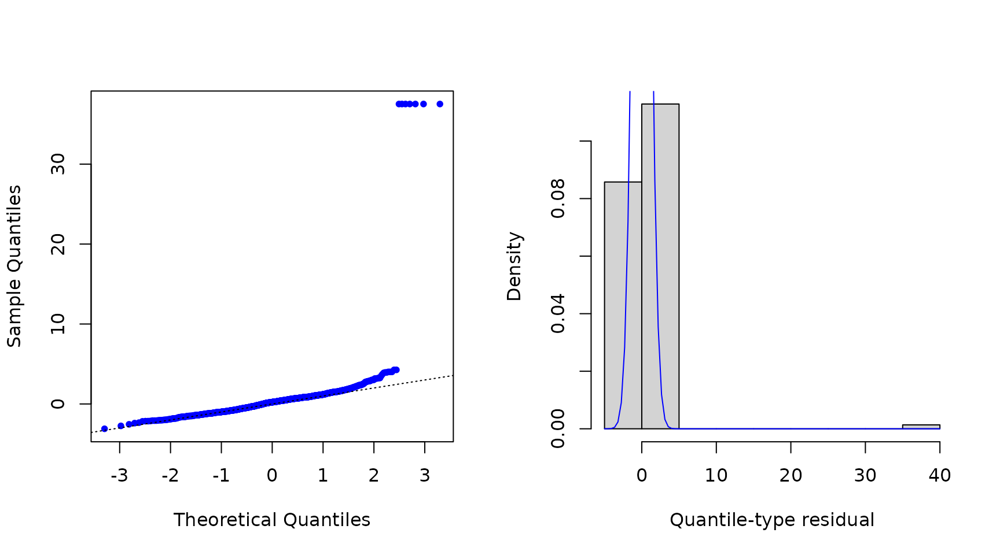
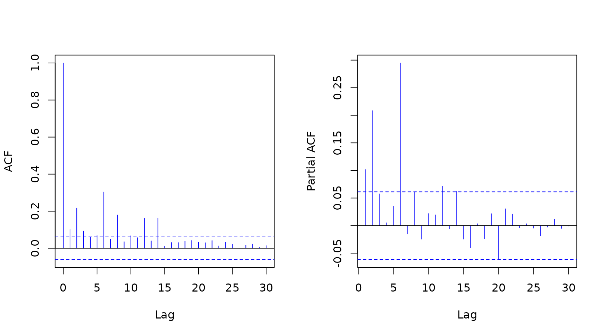

# Introduction to the mtarm Package

## Multivariate Threshold Autoregressive (TAR) models

The `mtarm` package provides a computational tool designed for Bayesian
estimation, inference, and forecasting in multivariate Threshold
Autoregressive (TAR) models. These models provide a versatile approach
for modeling nonlinear multivariate time series and include multivariate
Self-Exciting Threshold Autoregressive (SETAR) and Vector Autoregressive
(VAR) models as particular cases (Vanegas et al. 2025). The package
accommodates a broad class of innovation distributions beyond the
Gaussian assumption, such as Student-$`t`$, slash, symmetric hyperbolic,
Laplace, contaminated normal, skew-normal, and skew-$`t`$ distributions,
thereby enabling robust modeling of heavy tails, asymmetry, and other
non-Gaussian characteristics.

### Installation

#### Install from GitHub

``` r

remotes::install_github("lhvanegasp/mtarm")
```

#### Install from CRAN

``` r

install.packages("mtarm")
```

### Application: Temperature, precipitation, and two river flows in Iceland

#### Dataset

The data are available in the object \`iceland.rf\` and were obtained
from (Tong 1990), who provided a detailed description of the
geographical and meteorological characteristics of the rivers and
analyzed each series individually. Subsequently, (Tsay 1998) conducted a
bivariate analysis of the same dataset. The focus is on the bivariate
time series $`\{(Y_{1,t},Y_{2,t})^{\top}\}_{t\geq 1}`$, where
$`Y_{1,t}`$ and $`Y_{2,t}`$ denote the daily river flow (in cubic meters
per second, $`{m}^3/{s}`$) of the Jökulsá Eystri and Vatnsdalsá rivers,
respectively. The sample covers the period from 1972 to 1974, comprising
1095 observations. The exogenous variables include daily precipitation
$`X_t`$, measured in millimeters ($`{mm}`$), and temperature $`Z_t`$,
measured in degrees Celsius ($`^\circ\mathrm{C}`$), both recorded at the
meteorological station in Hveravellir. Precipitation corresponds to the
accumulated rainfall from 9:00 A.M. of the previous day to 9:00 A.M. of
the current day.

``` r

library(mtarm)
data(iceland.rf)       
str(iceland.rf)     
#> 'data.frame':    1096 obs. of  5 variables:
#>  $ Vatnsdalsa   : num  16.1 19.2 14.5 11 13.6 12.5 10.5 10.1 9.68 9.02 ...
#>  $ Jokulsa      : num  30.2 29 28.4 27.8 27.8 27.8 27.8 27.8 27.8 27.3 ...
#>  $ Precipitation: num  8.1 4.4 7 0 0 0 1.9 1.2 0 0.1 ...
#>  $ Temperature  : num  0.9 1.6 0.1 0.6 2 0.8 1.4 1.3 2.2 0.1 ...
#>  $ Date         : Date, format: "1972-01-01" "1972-01-02" ...
```

``` r

summary(iceland.rf[,-5])
#>    Vatnsdalsa        Jokulsa       Precipitation     Temperature      
#>  Min.   : 3.670   Min.   : 22.00   Min.   : 0.000   Min.   :-22.4000  
#>  1st Qu.: 6.100   1st Qu.: 26.70   1st Qu.: 0.000   1st Qu.: -4.2000  
#>  Median : 7.500   Median : 31.40   Median : 0.300   Median :  0.3000  
#>  Mean   : 8.938   Mean   : 41.15   Mean   : 2.519   Mean   : -0.4407  
#>  3rd Qu.: 9.240   3rd Qu.: 50.90   3rd Qu.: 2.500   3rd Qu.:  3.9000  
#>  Max.   :54.000   Max.   :143.00   Max.   :79.300   Max.   : 13.9000
```

``` r

plot(ts(as.matrix(iceland.rf[,-5])), main="Iceland")
```


#### Model specification

Following (Tsay 1998), the series are modeled using a
$`\mathrm{TAR}(2; p=(15,15), q=(4,4), d=(2,2))`$ specification given by

``` math
Y_t=
\sum_{j=1}^{2}
I\!\left(Z_{t-h}\in(c_{j-1},c_j]\right)
\left(\!
\phi_0^{^{(j)}}
+\sum_{i=1}^{15}\boldsymbol{\phi}_i^{^{(j)}}Y_{t-i}
+\sum_{i=1}^{4}\boldsymbol{\beta}_i^{^{(j)}}X_{t-i}
+\sum_{i=1}^{2}\delta_i^{^{(j)}}Z_{t-i}
+\epsilon_t^{^{(j)}}
\!\right)
```

where $`\epsilon_t^{^{(j)}}`$ is the error term. The last 55
observations (from November 7 to December 31, 1974), corresponding to
$`5\%`$ of the sample, are excluded from the estimation stage and
reserved for out-of-sample forecast evaluation. The following code
requests the estimation for the
$`\mathrm{TAR}(2; p=(15,15), q=(4,4), d=(2,2))`$ specification under
Gaussian, Student-$`t`$, and Laplace error distributions.

#### Parameter estimation

``` r

set.seed(09102)
fits <- mtar_grid(~ Jokulsa + Vatnsdalsa | Temperature | Precipitation,
                  data=iceland.rf, subset={Date<="1974-11-06"},                           
                  row.names=Date, nregim.min=2, nregim.max=2, p.min=15,                 
                  p.max=15, q.min=4, q.max=4, d.min=2, d.max=2,                           
                  n.burnin=3000, n.sim=3000, n.thin=2, ssvs=TRUE,
                  dist=c("Gaussian","Student-t","Laplace"),
                  plan_strategy="multisession")

fits
#> 
#> 
#> Sample size          : 1026 time points (1972-01-16 to 1974-11-06)
#> 
#> Output Series        : Jokulsa    |    Vatnsdalsa
#> 
#> Threshold Series (TS): Temperature
#> 
#> Exogenous Series (ES): Precipitation
#> 
#> Error Distribution   : Gaussian, Laplace, Student-t
#> 
#> Number of regimes    : 2
#> 
#> Deterministics       : Intercept
#> 
#> Autoregressive order : 15
#> 
#> Maximum lag for ES   : 4
#> 
#> Maximum lag for TS   : 2
```

#### Model comparison using forecast accuracy measures

##### Adjusted within-sample

The following code requests Deviance Information Criterion (DIC)
(Spiegelhalter et al. 2002, 2014) and Watanabe-Akaike Information
Criterion (WAIC) (Watanabe 2010) values.

``` r

DIC(fits)
#>                          DIC
#> Gaussian.2.15.4.2  10091.728
#> Laplace.2.15.4.2    6870.422
#> Student-t.2.15.4.2  7566.796

WAIC(fits)
#>                         WAIC
#> Gaussian.2.15.4.2  10398.890
#> Laplace.2.15.4.2    8289.334
#> Student-t.2.15.4.2  7618.343
```

##### Out-of-sample with standard $`h`$-step-ahead forecasting

In addition, the following code provides the median of the log-score
(Good 1952), the Energy Score (ES) (Gneiting et al. 2008)—a multivariate
extension of the Continuous Ranked Probability Score (CRPS)(Matheson and
Winkler 1976; Grimit et al. 2006)—and the Absolute Percentage Error
(APE), all computed from the observed and forecasted values for the last
55 observations.

``` r

newdata <- subset(iceland.rf, Date>"1974-11-06") 
set.seed(09102)

oos <- out_of_sample(fits, newdata=newdata, n.ahead=nrow(newdata), FUN=median) 
oos[,c(1,2,5,6)]
#>                    Log.Score Energy.Score Jokulsa.APE Vatnsdalsa.APE
#> Gaussian.2.15.4.2   3.809826     2.818781    5.464108       32.20760
#> Laplace.2.15.4.2    3.263099     1.845109    3.932707       17.06734
#> Student-t.2.15.4.2  3.560311     2.394057    3.552284       21.29055
```

##### Out-of-sample with rolling-origin forecasting and fixed parameters

``` r

set.seed(09102)
oos2 <- out_of_sample(fits, newdata=newdata, n.ahead=nrow(newdata), 
                      rolling=5, FUN=median) 

for(i in 1:length(oos2)){                   
   cat("\n",i,"-step-ahead\n")   
   print(oos2[[i]][,c(1,2,5,6)]) 
}                            
#> 
#>  1 -step-ahead
#>                    Log.Score Energy.Score Jokulsa.APE Vatnsdalsa.APE
#> Gaussian.2.15.4.2  2.5848801    1.2858163    1.473978       7.141664
#> Laplace.2.15.4.2   1.3291750    0.7867373    0.942096       4.513561
#> Student-t.2.15.4.2 0.9990159    0.7453130    1.026292       5.487411
#> 
#>  2 -step-ahead
#>                    Log.Score Energy.Score Jokulsa.APE Vatnsdalsa.APE
#> Gaussian.2.15.4.2   3.037145     1.631372    2.334850      11.463158
#> Laplace.2.15.4.2    2.126701     1.132147    1.539121       5.434709
#> Student-t.2.15.4.2  1.937540     1.171560    1.412842       6.953775
#> 
#>  3 -step-ahead
#>                    Log.Score Energy.Score Jokulsa.APE Vatnsdalsa.APE
#> Gaussian.2.15.4.2   3.214346     1.846055    2.816591      15.107053
#> Laplace.2.15.4.2    2.411231     1.275624    2.020383       6.556706
#> Student-t.2.15.4.2  2.246767     1.411644    1.932489       7.722336
#> 
#>  4 -step-ahead
#>                    Log.Score Energy.Score Jokulsa.APE Vatnsdalsa.APE
#> Gaussian.2.15.4.2   3.355270     1.968928    3.409630      17.605848
#> Laplace.2.15.4.2    2.615647     1.401618    2.371651       6.702571
#> Student-t.2.15.4.2  2.564320     1.622701    2.452800       7.260001
#> 
#>  5 -step-ahead
#>                    Log.Score Energy.Score Jokulsa.APE Vatnsdalsa.APE
#> Gaussian.2.15.4.2   3.419370     2.083328    3.764518      19.203017
#> Laplace.2.15.4.2    2.752003     1.481746    2.681036       7.042845
#> Student-t.2.15.4.2  2.763560     1.791679    2.783440       9.773941
```

#### Residuals

``` r

res <- residuals(fits$`Laplace.2.15.4.2`)  
```

``` r

par(mfrow=c(1,2)) 
qqnorm(res$full, pch=20, col="blue", main="") 
abline(0, 1, lty=3) 
hist(res$full, freq=FALSE, xlab="Quantile-type residual", ylab="Density", main="") 
curve(dnorm(x), col="blue", add=TRUE)
```



``` r

par(mfrow=c(1,2))  
acf(res$full, col="blue", main="")
pacf(res$full, col="blue", main="")
```



#### Forecasting

``` r

pred <- predict(fits$`Laplace.2.15.4.2`, newdata=newdata, n.ahead=nrow(newdata),
                row.names=Date, credible=0.8)

head(pred$summary)
#>            Jokulsa.Mean Jokulsa.Lower Jokulsa.Upper Vatnsdalsa.Mean
#> 1974-11-07     20.91140      12.80920      28.17211        6.836796
#> 1974-11-08     21.29486      10.76801      31.23515        7.040683
#> 1974-11-09     22.95505      14.42491      30.70915        7.334842
#> 1974-11-10     24.01130      17.16736      30.07457        7.387014
#> 1974-11-11     24.96303      19.75744      30.42388        7.447525
#> 1974-11-12     25.14406      20.90753      30.00710        7.275621
#>            Vatnsdalsa.Lower Vatnsdalsa.Upper
#> 1974-11-07         4.834481         8.544910
#> 1974-11-08         4.204605         9.600125
#> 1974-11-09         4.673395         9.982111
#> 1974-11-10         4.792595         9.827108
#> 1974-11-11         4.909666         9.923223
#> 1974-11-12         4.763787         9.632388
tail(pred$summary)
#>            Jokulsa.Mean Jokulsa.Lower Jokulsa.Upper Vatnsdalsa.Mean
#> 1974-12-26     25.63590      23.02109      28.31537        5.893641
#> 1974-12-27     25.64585      22.83112      28.17814        5.883682
#> 1974-12-28     25.64959      22.88285      28.28398        5.878568
#> 1974-12-29     25.62580      23.01030      28.36634        5.895742
#> 1974-12-30     25.63322      23.01880      28.37717        5.894161
#> 1974-12-31     25.57800      23.06069      28.35969        5.883065
#>            Vatnsdalsa.Lower Vatnsdalsa.Upper
#> 1974-12-26         3.815598         8.070009
#> 1974-12-27         3.690674         7.966998
#> 1974-12-28         3.771796         8.062414
#> 1974-12-29         3.840831         8.146696
#> 1974-12-30         3.914749         8.263871
#> 1974-12-31         3.866102         8.156226
```

#### Summary statistics

``` r

fitmcmc <- coda::as.mcmc(fits$`Laplace.2.15.4.2`)
summary(fitmcmc)
#> 
#> 
#>  Iterations = 3001:8999
#> 
#>  Thinning interval = 2
#> 
#>  Sample size per chain = 3000
#> 
#> Thresholds:
#>                 Mean      Sd Sd(Mean)     2.5%     25%      50%    75%   97.5%
#> Threshold.1 -0.26807 0.28762   0.1895 -0.49291 -0.4613 -0.42827 0.1127 0.29606
#> 
#> 
#> Regime 1
#> 
#> 
#> Autoregressive coefficients:
#>                                     Mean       Sd  Sd(Mean)      2.5%       25%
#> Jokulsa:(Intercept)            4.6808246 0.658957 0.1291049  3.639842  4.212007
#> Vatnsdalsa:(Intercept)         1.3118271 0.300288 0.0578317  0.774932  1.099911
#> Jokulsa:Jokulsa.lag( 1)        0.7629627 0.063672 0.0091609  0.632143  0.720872
#> Vatnsdalsa:Jokulsa.lag( 1)    -0.0858687 0.025331 0.0023472 -0.135550 -0.103154
#> Jokulsa:Vatnsdalsa.lag( 1)     0.3002716 0.064406 0.0045659  0.171115  0.261286
#> Vatnsdalsa:Vatnsdalsa.lag( 1)  1.0630063 0.063540 0.0099084  0.920381  1.025682
#> Jokulsa:Jokulsa.lag( 2)       -0.0038116 0.031617 0.0016285 -0.065825 -0.024490
#> Vatnsdalsa:Jokulsa.lag( 2)     0.0444125 0.017465 0.0010745  0.010548  0.032779
#> Jokulsa:Vatnsdalsa.lag( 2)    -0.2428660 0.065413 0.0054429 -0.365016 -0.288654
#> Vatnsdalsa:Vatnsdalsa.lag( 2) -0.2075183 0.045937 0.0035199 -0.294643 -0.236304
#>                                      50%       75%     97.5%
#> Jokulsa:(Intercept)            4.5662684  5.066312  6.107967
#> Vatnsdalsa:(Intercept)         1.2859815  1.501912  1.947414
#> Jokulsa:Jokulsa.lag( 1)        0.7680902  0.808427  0.874458
#> Vatnsdalsa:Jokulsa.lag( 1)    -0.0856541 -0.068605 -0.037718
#> Jokulsa:Vatnsdalsa.lag( 1)     0.3013330  0.342037  0.423870
#> Vatnsdalsa:Vatnsdalsa.lag( 1)  1.0686021  1.106575  1.171048
#> Jokulsa:Jokulsa.lag( 2)       -0.0043538  0.016069  0.056809
#> Vatnsdalsa:Jokulsa.lag( 2)     0.0446529  0.056312  0.078089
#> Jokulsa:Vatnsdalsa.lag( 2)    -0.2442959 -0.199370 -0.115274
#> Vatnsdalsa:Vatnsdalsa.lag( 2) -0.2096967 -0.180682 -0.105762
#> 
#> 
#> Scale parameter:
#>                          Mean       Sd  Sd(Mean)     2.5%      25%      50%
#> Jokulsa.Jokulsa       0.18382 0.043839 0.0180089 0.127405 0.153957 0.168919
#> Jokulsa.Vatnsdalsa    0.03069 0.011277 0.0032732 0.014508 0.022732 0.028326
#> Vatnsdalsa.Vatnsdalsa 0.06837 0.013612 0.0044437 0.047568 0.059037 0.065245
#>                            75%    97.5%
#> Jokulsa.Jokulsa       0.210458 0.281575
#> Jokulsa.Vatnsdalsa    0.036888 0.058298
#> Vatnsdalsa.Vatnsdalsa 0.076762 0.099438
#> 
#> 
#> Regime 2
#> 
#> 
#> 
#> Autoregressive coefficients:
#>                                     Mean        Sd   Sd(Mean)       2.5%
#> Jokulsa:(Intercept)            1.5281362 0.5168835 0.04418385  0.4532091
#> Vatnsdalsa:(Intercept)         0.5433903 0.1341078 0.01399387  0.2925832
#> Jokulsa:Jokulsa.lag( 1)        1.0798086 0.0371404 0.00119443  1.0135299
#> Vatnsdalsa:Jokulsa.lag( 1)    -0.0012335 0.0072211 0.00074398 -0.0153351
#> Jokulsa:Vatnsdalsa.lag( 1)     0.5896772 0.1302774 0.00449465  0.3335543
#> Vatnsdalsa:Vatnsdalsa.lag( 1)  1.1917907 0.0646773 0.01861489  1.1053604
#> Jokulsa:Jokulsa.lag( 2)       -0.2109753 0.0458756 0.00144610 -0.3075803
#> Vatnsdalsa:Jokulsa.lag( 2)     0.0034427 0.0085415 0.00027266 -0.0128431
#> Jokulsa:Vatnsdalsa.lag( 2)    -0.4916813 0.2767540 0.06194954 -1.0007906
#> Vatnsdalsa:Vatnsdalsa.lag( 2) -0.3548694 0.0918406 0.01456995 -0.5156868
#> Jokulsa:Jokulsa.lag( 3)       -0.0118103 0.0272395 0.00399632 -0.0676460
#> Vatnsdalsa:Jokulsa.lag( 3)    -0.0095950 0.0061699 0.00112238 -0.0202678
#> Jokulsa:Vatnsdalsa.lag( 3)     0.3783795 0.1200705 0.01426297  0.1584724
#> Vatnsdalsa:Vatnsdalsa.lag( 3)  0.1634618 0.0467303 0.00910015  0.0958836
#> Jokulsa:Temperature.lag(1)     1.1416817 0.1129518 0.00697565  0.9093445
#> Vatnsdalsa:Temperature.lag(1)  0.0492981 0.0205556 0.00055516  0.0080734
#> Jokulsa:Temperature.lag(2)    -0.6763926 0.1069777 0.00690553 -0.8822961
#> Vatnsdalsa:Temperature.lag(2) -0.0542592 0.0200831 0.00055057 -0.0937323
#>                                      25%        50%        75%      97.5%
#> Jokulsa:(Intercept)            1.2061600  1.5448521  1.8664917  2.5195412
#> Vatnsdalsa:(Intercept)         0.4565581  0.5421615  0.6277940  0.7932286
#> Jokulsa:Jokulsa.lag( 1)        1.0533589  1.0773869  1.1032631  1.1564953
#> Vatnsdalsa:Jokulsa.lag( 1)    -0.0059899 -0.0011776  0.0036425  0.0126003
#> Jokulsa:Vatnsdalsa.lag( 1)     0.5021599  0.5927170  0.6780890  0.8496727
#> Vatnsdalsa:Vatnsdalsa.lag( 1)  1.1451238  1.1760497  1.2229807  1.3544113
#> Jokulsa:Jokulsa.lag( 2)       -0.2383652 -0.2109524 -0.1834071 -0.1187178
#> Vatnsdalsa:Jokulsa.lag( 2)    -0.0019253  0.0029078  0.0084281  0.0219362
#> Jokulsa:Vatnsdalsa.lag( 2)    -0.7017220 -0.5102216 -0.2625981 -0.0179990
#> Vatnsdalsa:Vatnsdalsa.lag( 2) -0.4214391 -0.3680277 -0.2831826 -0.1797927
#> Jokulsa:Jokulsa.lag( 3)       -0.0262279 -0.0190080  0.0096407  0.0373081
#> Vatnsdalsa:Jokulsa.lag( 3)    -0.0147908 -0.0104029 -0.0040885  0.0017226
#> Jokulsa:Vatnsdalsa.lag( 3)     0.3173357  0.3802099  0.4566453  0.6022998
#> Vatnsdalsa:Vatnsdalsa.lag( 3)  0.1380112  0.1560011  0.1968263  0.2584063
#> Jokulsa:Temperature.lag(1)     1.0674440  1.1441608  1.2213619  1.3512223
#> Vatnsdalsa:Temperature.lag(1)  0.0358429  0.0495348  0.0632154  0.0881845
#> Jokulsa:Temperature.lag(2)    -0.7473684 -0.6799000 -0.6055185 -0.4633394
#> Vatnsdalsa:Temperature.lag(2) -0.0676340 -0.0542198 -0.0403236 -0.0159961
#> 
#> 
#> Scale parameter:
#>                          Mean       Sd  Sd(Mean)    2.5%     25%     50%
#> Jokulsa.Jokulsa       5.61616 0.506019 0.0254867 4.65332 5.28288 5.60880
#> Jokulsa.Vatnsdalsa    0.31196 0.065002 0.0026105 0.18728 0.26881 0.31013
#> Vatnsdalsa.Vatnsdalsa 0.30304 0.026140 0.0015971 0.25437 0.28510 0.30206
#>                           75%   97.5%
#> Jokulsa.Jokulsa       5.95399 6.61387
#> Jokulsa.Vatnsdalsa    0.35485 0.44285
#> Vatnsdalsa.Vatnsdalsa 0.32012 0.35739
```

#### Convergence diagnostics

##### Geweke statistic

``` r

geweke_diagTAR(fits$`Laplace.2.15.4.2`)
#> 
#> Fraction in 1st window = 0.1
#> 
#> Fraction in 2nd window = 0.5
#> Thresholds:
#> Threshold.1 
#>      36.927
#> 
#> 
#> Regime 1
#> 
#> 
#> Autoregressive coefficients:
#>                    Jokulsa Vatnsdalsa
#> (Intercept)         0.5708    6.98895
#> Jokulsa.lag( 1)     4.4295    1.99673
#> Vatnsdalsa.lag( 1)  6.9359  -14.45981
#> Jokulsa.lag( 2)    -5.4249    0.87996
#> Vatnsdalsa.lag( 2) -3.3493    7.60875
#> 
#> 
#> Scale parameter:
#>            Jokulsa Vatnsdalsa
#> Jokulsa     54.447     41.605
#> Vatnsdalsa  41.605     30.340
#> 
#> 
#> Regime 2
#> 
#> 
#> 
#> Autoregressive coefficients:
#>                    Jokulsa Vatnsdalsa
#> (Intercept)        -8.7876  -14.15374
#> Jokulsa.lag( 1)     1.6798  -16.36745
#> Vatnsdalsa.lag( 1) -0.5173   28.43093
#> Jokulsa.lag( 2)    -4.4888   -4.29973
#> Vatnsdalsa.lag( 2)  8.9888    3.37201
#> Jokulsa.lag( 3)    33.2376   26.64616
#> Vatnsdalsa.lag( 3) -2.9253  -27.31831
#> Temperature.lag(1)  9.4932    1.92462
#> Temperature.lag(2) -8.9037   -0.13241
#> 
#> 
#> Scale parameter:
#>            Jokulsa Vatnsdalsa
#> Jokulsa     8.4993    -8.3598
#> Vatnsdalsa -8.3598   -10.0820
```

##### Effective sample size

``` r

effectiveSize_TAR(fits$`Laplace.2.15.4.2`) 
#> Thresholds:
#> Threshold.1 
#>      2.3036
#> 
#> 
#> Regime 1
#> 
#> 
#> Autoregressive coefficients:
#>                    Jokulsa Vatnsdalsa
#> (Intercept)         26.051     26.962
#> Jokulsa.lag( 1)     48.309    116.472
#> Vatnsdalsa.lag( 1) 198.980     41.124
#> Jokulsa.lag( 2)    376.949    264.179
#> Vatnsdalsa.lag( 2) 144.435    170.319
#> 
#> 
#> Scale parameter:
#>            Jokulsa Vatnsdalsa
#> Jokulsa     5.9257     11.871
#> Vatnsdalsa 11.8707      9.383
#> 
#> 
#> Regime 2
#> 
#> 
#> 
#> Autoregressive coefficients:
#>                     Jokulsa Vatnsdalsa
#> (Intercept)         136.854     91.840
#> Jokulsa.lag( 1)     966.883     94.207
#> Vatnsdalsa.lag( 1)  840.130     12.072
#> Jokulsa.lag( 2)    1006.389    981.342
#> Vatnsdalsa.lag( 2)   19.958     39.733
#> Jokulsa.lag( 3)      46.460     30.219
#> Vatnsdalsa.lag( 3)   70.868     26.369
#> Temperature.lag(1)  262.191   1370.953
#> Temperature.lag(2)  239.990   1330.544
#> 
#> 
#> Scale parameter:
#>            Jokulsa Vatnsdalsa
#> Jokulsa     394.19     620.00
#> Vatnsdalsa  620.00     267.87
```

Gneiting, Tilmann, Laura I. Stanberry, Eric P. Grimit, Leonhard Held,
and Nicholas A. Johnson. 2008. “Assessing Probabilistic Forecasts of
Multivariate Quantities, with an Application to Ensemble Predictions of
Surface Winds.” *TEST* 17 (2): 211–35.
<https://doi.org/10.1007/s11749-008-0114-x>.

Good, I. J. 1952. “Rational Decisions.” *Journal of the Royal
Statistical Society: Series B (Methodological)* 14 (1): 107–14.

Grimit, Eric P., Tilmann Gneiting, Veronica J. Berrocal, and Nicholas A.
Johnson. 2006. “The Continuous Ranked Probability Score for Circular
Variables and Its Application to Mesoscale Forecast Ensemble
Verification.” *Quarterly Journal of the Royal Meteorological Society*
132 (621C): 2925–42. <https://doi.org/10.1256/qj.05.235>.

Matheson, James E., and Robert L. Winkler. 1976. “Scoring Rules for
Continuous Probability Distributions.” *Management Science* 22 (10):
1087–96. <https://doi.org/10.1287/mnsc.22.10.1087>.

Spiegelhalter, D. J., N. G. Best, B. P. Carlin, and A. Van Der Linde.
2014. “The Deviance Information Criterion: 12 Years on.” *Journal of the
Royal Statistical Society Series B: (Statistical Methodology)* 76 (3):
485–93.

Spiegelhalter, D. J., N. G Best, B. P. Carlin, and A. Van Der Linde.
2002. “Bayesian Measures of Model Complexity and Fit.” *Journal of the
Royal Statistical Society: Series B (Statistical Methodology)* 64 (4):
583–639.

Tong, Howell. 1990. *Non‑linear Time Series: A Dynamical System
Approach*. Oxford Statistical Science Series. Oxford University Press.

Tsay, Ruey S. 1998. “Testing and Modeling Multivariate Threshold
Models.” *Journal of the American Statistical Association* 93 (443):
1188–202. <https://doi.org/10.1080/01621459.1998.10473779>.

Vanegas, L. H., S. A. Calderón V, and L. M. Rondón. 2025. “Bayesian
Estimation of a Multivariate TAR Model When the Noise Process
Distribution Belongs to the Class of Gaussian Variance Mixtures.”
*International Journal of Forecasting*, ahead of print.
https://doi.org/<https://doi.org/10.1016/j.ijforecast.2025.08.001>.

Watanabe, S. 2010. “Asymptotic Equivalence of Bayes Cross Validation and
Widely Applicable Information Criterion in Singular Learning Theory.”
*The Journal of Machine Learning Research* 11: 3571–94.
