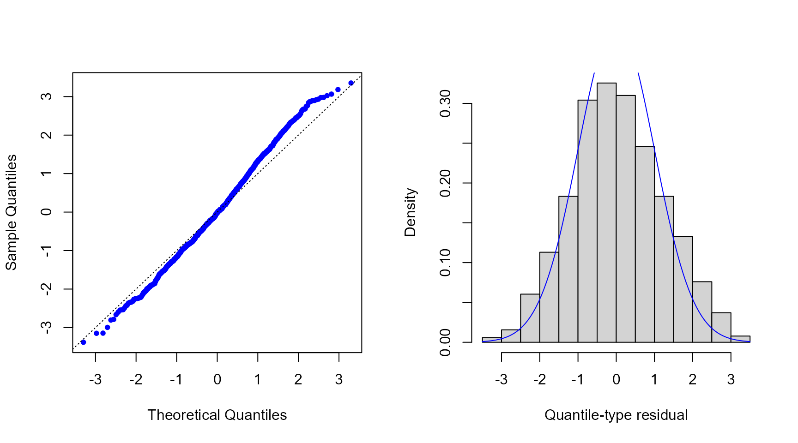
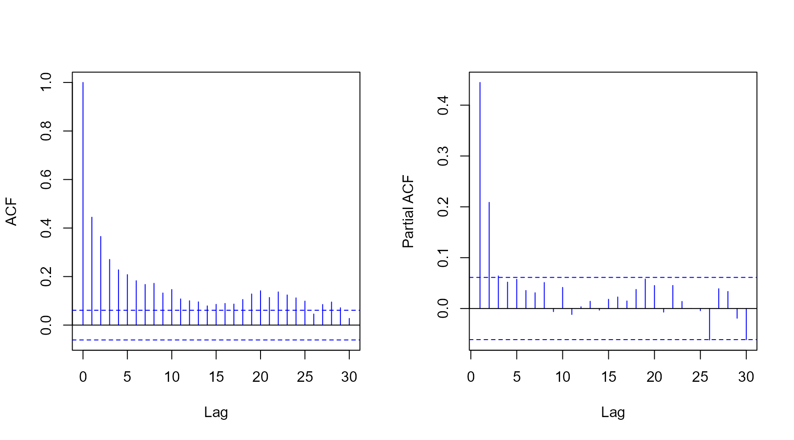

# Introduction to the mtarm Package

## Multivariate Threshold Autoregressive (TAR) models

The `mtarm` package provides a computational tool designed for Bayesian
estimation, inference, and forecasting in multivariate Threshold
Autoregressive (TAR) models. These models provide a versatile approach
for modeling nonlinear multivariate time series and include multivariate
Self-Exciting Threshold Autoregressive (SETAR) and Vector Autoregressive
(VAR) models as particular cases (Vanegas, Calderón V, and Rondón 2025).
The package accommodates a broad class of innovation distributions
beyond the Gaussian assumption, such as Student-$`t`$, slash, symmetric
hyperbolic, Laplace, contaminated normal, skew-normal, and skew-$`t`$
distributions, thereby enabling robust modeling of heavy tails,
asymmetry, and other non-Gaussian characteristics.

### Installation

#### Install from GitHub

``` r
remotes::install_github("lhvanegasp/mtarm")
```

#### Install from CRAN

``` r
install.packages("mtarm")
```

### Application: Temperature, precipitation, and two river flows in Iceland

#### Dataset

The data are available in the object \`iceland.rf\` and were obtained
from (Tong 1990), who provided a detailed description of the
geographical and meteorological characteristics of the rivers and
analyzed each series individually. Subsequently, (Tsay 1998) conducted a
bivariate analysis of the same dataset. The focus is on the bivariate
time series $`\{(Y_{1,t},Y_{2,t})^{\top}\}_{t\geq 1}`$, where
$`Y_{1,t}`$ and $`Y_{2,t}`$ denote the daily river flow (in cubic meters
per second, $`{m}^3/{s}`$) of the Jökulsá Eystri and Vatnsdalsá rivers,
respectively. The sample covers the period from 1972 to 1974, comprising
1095 observations. The exogenous variables include daily precipitation
$`X_t`$, measured in millimeters ($`{mm}`$), and temperature $`Z_t`$,
measured in degrees Celsius ($`^\circ\mathrm{C}`$), both recorded at the
meteorological station in Hveravellir. Precipitation corresponds to the
accumulated rainfall from 9:00 A.M. of the previous day to 9:00 A.M. of
the current day.

``` r
library(mtarm)
data(iceland.rf)       
str(iceland.rf)     
#> 'data.frame':    1096 obs. of  5 variables:
#>  $ Vatnsdalsa   : num  16.1 19.2 14.5 11 13.6 12.5 10.5 10.1 9.68 9.02 ...
#>  $ Jokulsa      : num  30.2 29 28.4 27.8 27.8 27.8 27.8 27.8 27.8 27.3 ...
#>  $ Precipitation: num  8.1 4.4 7 0 0 0 1.9 1.2 0 0.1 ...
#>  $ Temperature  : num  0.9 1.6 0.1 0.6 2 0.8 1.4 1.3 2.2 0.1 ...
#>  $ Date         : Date, format: "1972-01-01" "1972-01-02" ...
```

``` r
summary(iceland.rf[,-5])
#>    Vatnsdalsa        Jokulsa       Precipitation     Temperature      
#>  Min.   : 3.670   Min.   : 22.00   Min.   : 0.000   Min.   :-22.4000  
#>  1st Qu.: 6.100   1st Qu.: 26.70   1st Qu.: 0.000   1st Qu.: -4.2000  
#>  Median : 7.500   Median : 31.40   Median : 0.300   Median :  0.3000  
#>  Mean   : 8.938   Mean   : 41.15   Mean   : 2.519   Mean   : -0.4407  
#>  3rd Qu.: 9.240   3rd Qu.: 50.90   3rd Qu.: 2.500   3rd Qu.:  3.9000  
#>  Max.   :54.000   Max.   :143.00   Max.   :79.300   Max.   : 13.9000
```

``` r
plot(ts(as.matrix(iceland.rf[,-5])), main="Iceland")
```


#### Model specification

Following (Tsay 1998), the series are modeled using a
$`\mathrm{TAR}(2; p=(15,15), q=(4,4), d=(2,2))`$ specification given by

\$\$Y_t=\sum\limits\_{j=1}^2
I(Z\_{t-h}\in(c\_{j-1},c_j\])\Big(\\{\phi}\_0^{^{(j)}}+\sum\limits\_{i=1}^{15}\boldsymbol{\phi}\_i^{^{(j)}}Y\_{t-i}+\sum\limits\_{i=1}^{4}\boldsymbol{\beta}\_i^{^{(j)}}\\X\_{t-i}+\sum\limits\_{i=1}^{2}{\delta}\_i^{^{(j)}}\\Z\_{t-i}+\epsilon_t^{^{(j)}}\\\Big),\$\$

where $`\epsilon_t^{^{(j)}}`$ is the error term. The last 55
observations (from November 7 to December 31, 1974), corresponding to
$`5\%`$ of the sample, are excluded from the estimation stage and
reserved for out-of-sample forecast evaluation. The following code
requests the estimation for the
$`\mathrm{TAR}(2; p=(15,15), q=(4,4), d=(2,2))`$ specification under
Gaussian, Slash, Student-$`t`$, and Laplace error distributions.

#### Parameter estimation

``` r
fits <- mtar_grid(~ Jokulsa + Vatnsdalsa | Temperature | Precipitation,
                  data=iceland.rf, subset={Date<="1974-11-06"},                           
                  row.names=Date, nregim.min=2, nregim.max=2, p.min=15,                 
                  p.max=15, q.min=4, q.max=4, d.min=2, d.max=2,                           
                  n.burnin=200, n.sim=300, n.thin=3, ssvs=TRUE,
                  dist=c("Gaussian","Slash","Student-t","Laplace"),
                  plan_strategy="multisession")

fits
#> 
#> 
#> Sample size          :1026 time points (1972-01-16 to 1974-11-06)
#> 
#> Output Series        :Jokulsa    |    Vatnsdalsa
#> 
#> Threshold Series (TS):Temperature with a estimated delay equal to 0
#> 
#> Exogenous Series (ES):Precipitation
#> 
#> Error Distribution   :Gaussian
#> 
#> Number of regimes    :2 to 2
#> 
#> Deterministics       :Intercept
#> 
#> Autoregressive orders:15 to 15
#> 
#> Maximum lags for ES  :4 to 4
#> 
#> Maximum lags for TS  :2 to 2
```

#### Model comparison using forecast accuracy measures

##### Adjusted within-sample

The following code requests Deviance Information Criterion (DIC)
(Spiegelhalter et al. 2002, 2014) and Watanabe-Akaike Information
Criterion (WAIC) (Watanabe 2010) values.

``` r
DICs <- DIC(fits)
DICs
#>                         DIC
#> Gaussian.2.15.4.2  9436.697
#> Laplace.2.15.4.2   8004.425
#> Slash.2.15.4.2     8937.387
#> Student-t.2.15.4.2 7568.318

WAICs <- WAIC(fits)
WAICs
#>                         WAIC
#> Gaussian.2.15.4.2   9548.505
#> Laplace.2.15.4.2    8128.171
#> Slash.2.15.4.2     11455.987
#> Student-t.2.15.4.2  7611.521
```

##### Out-of-sample

In addition, the following code provides the median of the log-score
(Good 1952), the Energy Score (ES) (Gneiting et al. 2008)—a multivariate
extension of the Continuous Ranked Probability Score (CRPS)(Matheson and
Winkler 1976; Grimit et al. 2006)—and the Absolute Percentage Error
(APE), all computed from the observed and forecasted values for the last
55 observations.

``` r
newdata <- subset(iceland.rf, Date>"1974-11-06") 
oos <- out_of_sample(fits, newdata=newdata, n.ahead=nrow(newdata),  
                     by.component=TRUE, FUN=median) 
oos[,c(1,2,5,6)]
#>                    Log.Score Energy.Score  Jokulsa.APE Vatnsdalsa.APE
#> Gaussian.2.15.4.2   3.024220 1.646199e+00 4.619251e+00   1.991865e+01
#> Laplace.2.15.4.2    3.314595 1.935466e+00 4.052850e+00   1.854437e+01
#> Slash.2.15.4.2     10.536189 5.020090e+12 1.126195e+13   1.797553e+14
#> Student-t.2.15.4.2  3.613492 2.466212e+00 3.573211e+00   2.159836e+01
```

#### Residuals

``` r
res <- residuals(fits$`Student-t.2.15.4.2`)  
```

``` r
par(mfrow=c(1,2)) 
qqnorm(res$full, pch=20, col="blue", main="") 
abline(0, 1, lty=3) 
hist(res$full, freq=FALSE, xlab="Quantile-type residual", ylab="Density", main="") 
curve(dnorm(x), col="blue", add=TRUE)
```



``` r
par(mfrow=c(1,2))  
acf(res$full, col="blue", main="")
pacf(res$full, col="blue", main="")
```



#### Forecasting

``` r
pred <- predict(fits$`Student-t.2.15.4.2`, newdata=newdata, n.ahead=nrow(newdata),
                row.names=Date, credible=0.8)

head(pred$summary)
#>            Jokulsa.Mean Jokulsa.Lower Jokulsa.Upper Vatnsdalsa.Mean
#> 1974-11-07     27.21316      25.76946      28.46264        7.404870
#> 1974-11-08     27.01323      24.86831      28.75462        7.472812
#> 1974-11-09     26.75234      24.75151      29.56973        7.373822
#> 1974-11-10     26.58236      24.13360      29.37635        7.240455
#> 1974-11-11     26.44036      23.55372      29.06317        7.107537
#> 1974-11-12     26.41050      23.08747      28.86329        6.908370
#>            Vatnsdalsa.Lower Vatnsdalsa.Upper
#> 1974-11-07         6.835809         8.288433
#> 1974-11-08         6.311423         8.693522
#> 1974-11-09         5.664342         8.886327
#> 1974-11-10         5.037076         8.682407
#> 1974-11-11         4.839237         9.409943
#> 1974-11-12         4.539432         9.455680
tail(pred$summary)
#>            Jokulsa.Mean Jokulsa.Lower Jokulsa.Upper Vatnsdalsa.Mean
#> 1974-12-26     25.84591      22.73476      29.33715        6.308694
#> 1974-12-27     25.79648      22.01993      28.75240        6.239637
#> 1974-12-28     25.82312      22.80695      29.42083        6.262354
#> 1974-12-29     25.84683      22.47483      29.06715        6.344775
#> 1974-12-30     25.80999      23.10747      29.04295        6.316401
#> 1974-12-31     25.87735      23.28161      29.61837        6.268220
#>            Vatnsdalsa.Lower Vatnsdalsa.Upper
#> 1974-12-26         2.423741         8.819013
#> 1974-12-27         2.673335         9.103902
#> 1974-12-28         3.046894         9.275374
#> 1974-12-29         2.791733         8.786324
#> 1974-12-30         3.086214         8.922990
#> 1974-12-31         2.948773         9.080198
```

#### Convergence diagnostics

##### Geweke statistic

``` r
geweke_diagTAR(fits$`Student-t.2.15.4.2`)
#> 
#> Fraction in 1st window = 0.1
#> 
#> Fraction in 2nd window = 0.5
#> Thresholds:
#>                  
#> threshold 0.12569
#> 
#> 
#> Autoregressive coefficients:
#>                                Regime 1   Regime 2
#> Jokulsa:(Intercept)           -2.153633  0.7509429
#> Jokulsa:Jokulsa.lag( 1)        1.438730  0.5940345
#> Jokulsa:Jokulsa.lag( 2)       -0.322513 -0.8607335
#> Jokulsa:Vatnsdalsa.lag( 1)     1.809104 -0.6580059
#> Jokulsa:Vatnsdalsa.lag( 2)    -2.248465  0.3091728
#> Jokulsa:Temperature.lag(1)               1.2735817
#> Jokulsa:Temperature.lag(2)              -0.0335677
#> Vatnsdalsa:(Intercept)        -2.175712  0.1368150
#> Vatnsdalsa:Jokulsa.lag( 1)     1.239638 -0.6052781
#> Vatnsdalsa:Jokulsa.lag( 2)    -0.709139  0.3380195
#> Vatnsdalsa:Vatnsdalsa.lag( 1)  0.572919  0.8321379
#> Vatnsdalsa:Vatnsdalsa.lag( 2) -0.046631 -0.8718642
#> Vatnsdalsa:Temperature.lag(1)           -0.5399509
#> Vatnsdalsa:Temperature.lag(2)           -0.0027549
#> 
#> 
#> Scale parameter:
#>                       Regime 1 Regime 2
#> Jokulsa.Jokulsa         2.9745 1.941601
#> Jokulsa.Vatnsdalsa      3.0663 0.087331
#> Vatnsdalsa.Vatnsdalsa   1.9048 0.931698
#> 
#> 
#> Extra parameter:
#>           
#> nu -0.2317
```

##### Effective sample size

``` r
effectiveSize_TAR(fits$`Student-t.2.15.4.2`) 
#> Thresholds:
#>                 
#> threshold 68.963
#> 
#> 
#> Autoregressive coefficients:
#>                               Regime 1 Regime 2
#> Jokulsa:(Intercept)             196.21  231.123
#> Jokulsa:Jokulsa.lag( 1)         300.00  124.447
#> Jokulsa:Jokulsa.lag( 2)         300.00   97.811
#> Jokulsa:Vatnsdalsa.lag( 1)      230.46  207.389
#> Jokulsa:Vatnsdalsa.lag( 2)      229.69  300.000
#> Jokulsa:Temperature.lag(1)              249.284
#> Jokulsa:Temperature.lag(2)              432.022
#> Vatnsdalsa:(Intercept)          230.77   90.951
#> Vatnsdalsa:Jokulsa.lag( 1)      300.00  248.125
#> Vatnsdalsa:Jokulsa.lag( 2)      253.19  300.000
#> Vatnsdalsa:Vatnsdalsa.lag( 1)   144.64   41.228
#> Vatnsdalsa:Vatnsdalsa.lag( 2)   179.61   44.125
#> Vatnsdalsa:Temperature.lag(1)           397.460
#> Vatnsdalsa:Temperature.lag(2)           300.000
#> 
#> 
#> Scale parameter:
#>                       Regime 1 Regime 2
#> Jokulsa.Jokulsa         66.831   303.01
#> Jokulsa.Vatnsdalsa     223.418   251.58
#> Vatnsdalsa.Vatnsdalsa  149.255   167.11
#> 
#> 
#> Extra parameter:
#>          
#> nu 336.76
```

Gneiting, Tilmann, Laura I. Stanberry, Eric P. Grimit, Leonhard Held,
and Nicholas A. Johnson. 2008. “Assessing Probabilistic Forecasts of
Multivariate Quantities, with an Application to Ensemble Predictions of
Surface Winds.” *TEST* 17 (2): 211–35.
<https://doi.org/10.1007/s11749-008-0114-x>.

Good, I. J. 1952. “Rational Decisions.” *Journal of the Royal
Statistical Society: Series B (Methodological)* 14 (1): 107–14.

Grimit, Eric P., Tilmann Gneiting, Veronica J. Berrocal, and Nicholas A.
Johnson. 2006. “The Continuous Ranked Probability Score for Circular
Variables and Its Application to Mesoscale Forecast Ensemble
Verification.” *Quarterly Journal of the Royal Meteorological Society*
132 (621C): 2925–42. <https://doi.org/10.1256/qj.05.235>.

Matheson, James E., and Robert L. Winkler. 1976. “Scoring Rules for
Continuous Probability Distributions.” *Management Science* 22 (10):
1087–96. <https://doi.org/10.1287/mnsc.22.10.1087>.

Spiegelhalter, D. J., N. G. Best, B. P. Carlin, and A. Van Der Linde.
2014. “The Deviance Information Criterion: 12 Years on.” *Journal of the
Royal Statistical Society Series B: (Statistical Methodology)* 76 (3):
485–93.

Spiegelhalter, D. J., N. G Best, B. P. Carlin, and A. Van Der Linde.
2002. “Bayesian Measures of Model Complexity and Fit.” *Journal of the
Royal Statistical Society: Series B (Statistical Methodology)* 64 (4):
583–639.

Tong, Howell. 1990. *Non‑linear Time Series: A Dynamical System
Approach*. Oxford Statistical Science Series. Oxford, UK: Oxford
University Press.

Tsay, Ruey S. 1998. “Testing and Modeling Multivariate Threshold
Models.” *Journal of the American Statistical Association* 93 (443):
1188–1202. <https://doi.org/10.1080/01621459.1998.10473779>.

Vanegas, L. H., S. A. Calderón V, and L. M. Rondón. 2025. “Bayesian
Estimation of a Multivariate TAR Model When the Noise Process
Distribution Belongs to the Class of Gaussian Variance Mixtures.”
*International Journal of Forecasting*.
https://doi.org/<https://doi.org/10.1016/j.ijforecast.2025.08.001>.

Watanabe, S. 2010. “Asymptotic Equivalence of Bayes Cross Validation and
Widely Applicable Information Criterion in Singular Learning Theory.”
*The Journal of Machine Learning Research* 11: 3571–94.
